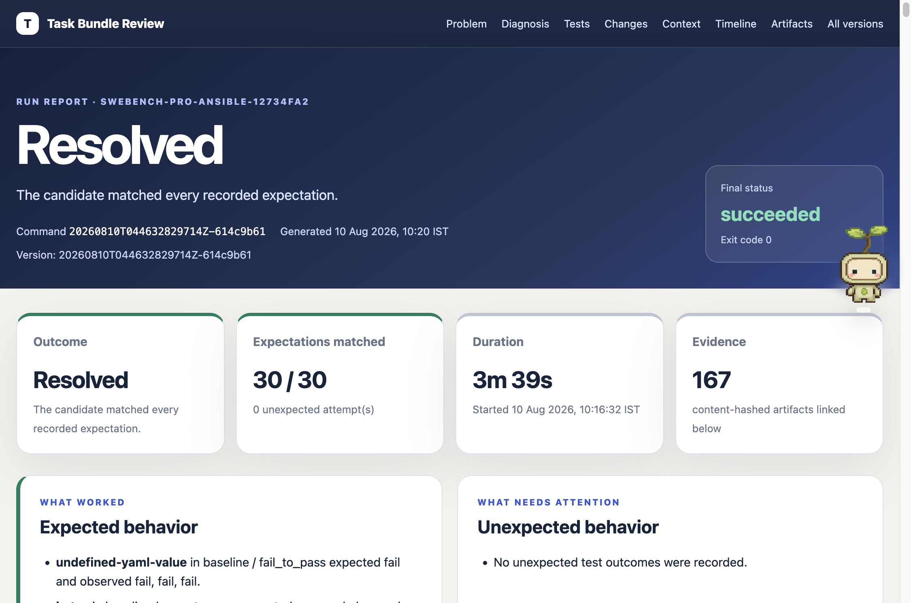
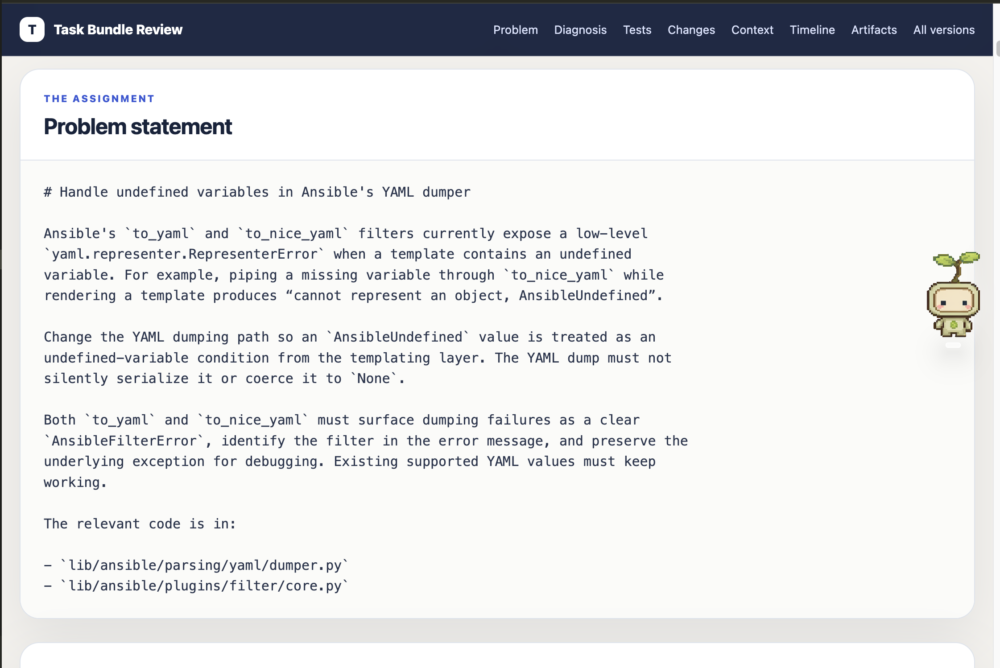
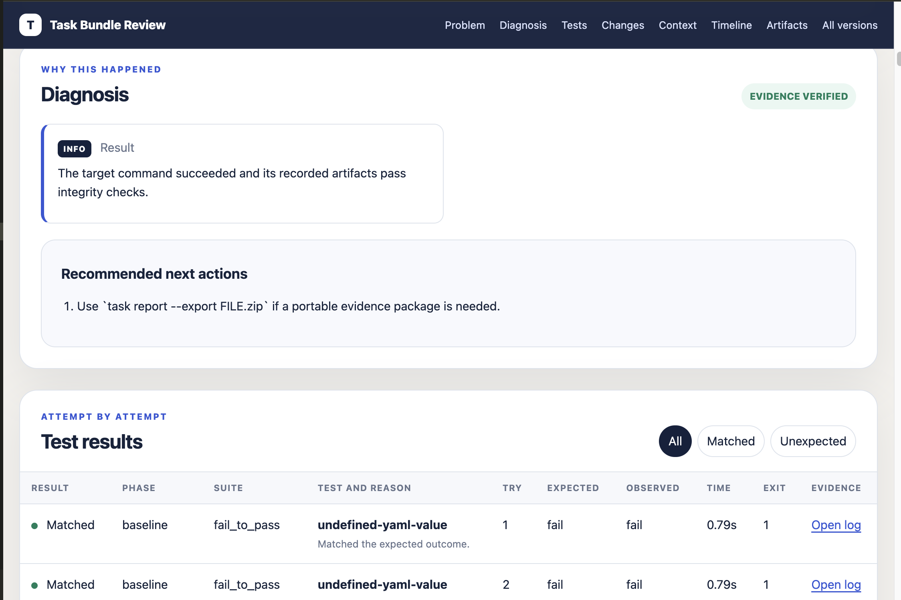
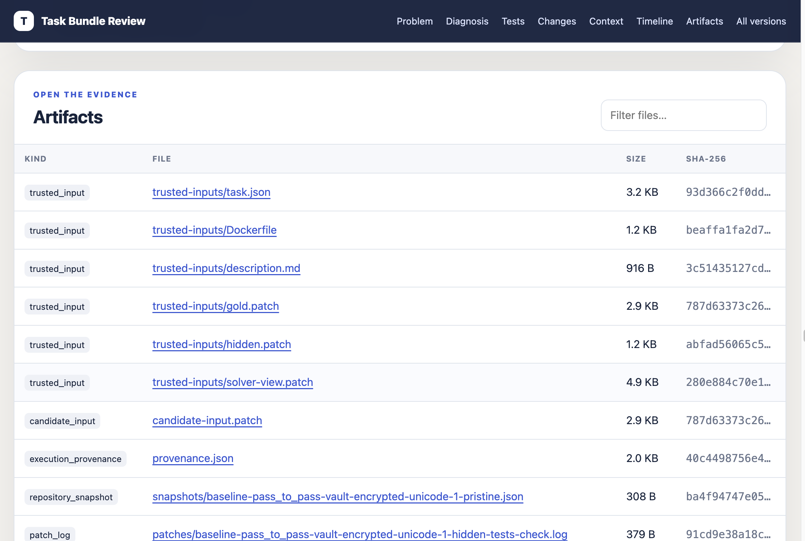

# Task Bundle CLI

Task Bundle CLI is a local judge for coding tasks. It pins one repository revision, proves the task's baseline and reference-solution behavior, runs a solver without exposing evaluator tests, grades only the captured candidate patch, and records reviewable JSON and HTML evidence.

This repository contains:

- the Python CLI in `src/taskbundle/`;
- two validated SWE-bench Pro Ansible bundles in `examples/`;
- checked-in pass/fail summaries in each bundle's `evaluation.json`;
- architecture, decisions, tradeoffs, and known limits in `DESIGN.md`.

## Design decisions

The project's architecture and design decisions are documented in [DESIGN.md](DESIGN.md). Start with its ["Decisions at a glance"](DESIGN.md#decisions-at-a-glance) section for a concise overview, then use the linked sections for the rationale, tradeoffs, and limits behind each choice.

The proposed direction for supporting repositories beyond the Python examples is described in [General Repository Support](GENERAL_REPOSITORY_SUPPORT.md). This is a short future-work note, not a claim that arbitrary repository support has been completed in this assignment.

## Install

Requirements:

- Python 3.12 or newer;
- [uv](https://docs.astral.sh/uv/);
- Git;
- the Docker CLI and a local Docker-compatible daemon (for example, Colima or Docker Desktop).

```bash
uv sync --frozen
uv run task --help

# Optional here; recommended before init, full validate, or run.
uv run task doctor .
```

The examples below use `uv run task` so they work directly from this checkout. An installed package exposes the same CLI as `task`.

## Set up Docker first

Docker is required for `init`, full `validate`, and `run`. It is not needed for `task new`, `task validate --static`, or reading an existing report. Choose one local Docker-compatible runtime: Colima, Docker Desktop, or Docker Engine. You do not need to install more than one.

After installing your chosen runtime, this recommended check confirms the CLI and daemon are available:

```bash
uv run task doctor .
docker version
docker run --rm hello-world
```

### Option A: Colima on macOS

[Colima](https://github.com/abiosoft/colima) is a lightweight Docker runtime for macOS. With Homebrew, install both the runtime and Docker client, then start the runtime:

```bash
brew install colima docker
colima start
docker run --rm hello-world
uv run task doctor .
```

After this first setup, when the active context is `colima` (or `DOCKER_HOST` points at a Colima socket), Task Bundle automatically runs `colima start <profile>` and waits for Docker during `init`, full `validate`, `run`, or `doctor`. It never starts Docker Desktop or another provider. Set `TASKBUNDLE_AUTO_START_COLIMA=0` to opt out.

If the command says the Docker socket is still unavailable, first run `docker version`. If it still fails and it is safe to interrupt existing containers, restart the reported profile and rerun the command:

```bash
colima restart <profile>
uv run task doctor .
```

### Option B: Docker Desktop or Docker Engine

[Docker Desktop](https://docs.docker.com/desktop/) is the Colima alternative on macOS and is also available on Windows and Linux. Start it before using the lifecycle. On Linux, [Docker Engine](https://docs.docker.com/engine/install/) can be installed directly instead; ensure the current user can access its daemon. Task Bundle CLI does not start either of these providers automatically.

## Run the primary included bundle end to end

The primary included bundle is a real SWE-bench Pro Ansible task. Its repository commit, digest-pinned base image, test commands, evaluator patches, reference patch, and compact evaluation result are checked in.

### What is required?

| Action | Status | When it is needed |
| --- | --- | --- |
| Install Python, uv, Git, and one Docker runtime | Required | Before the Docker-backed lifecycle can run. |
| `task doctor` | Recommended | Before the first lifecycle run or when diagnosing the environment. |
| `task validate --static` | Optional, recommended | Fast authoring checks without cloning or Docker. |
| `task init` | Required | Before full validation or any solver run. Reuses verified images when possible. |
| Full `task validate` | Required for complete bundle verification | Proves baseline and reference behavior; an already trusted initialized bundle can be run without repeating it every time. |
| One solver run | Required to evaluate a candidate | Choose exactly one of `agent`, `patch`, or `stub`. |
| `task report` | Recommended | Verifies evidence and explains the selected result. |
| `--events` and `--export` | Optional | Use for a detailed timeline or portable reviewer evidence. |
| OpenRouter configuration | Optional | Required only for the `agent` solver; not used by `patch` or `stub`. |

### 1. Prepare and validate the bundle

```bash
# Recommended environment check. It also starts a configured Colima profile.
uv run task doctor .

# Optional fast authoring checks; no clone or Docker is needed.
uv run task validate examples/swe-bench-pro-ansible --static

# Required before full validation or a solver run.
uv run task init examples/swe-bench-pro-ansible

# Required for the complete verification loop; proves the task contract.
uv run task validate examples/swe-bench-pro-ansible
```

### 2. Choose one solver

| Solver | Use it when | Additional requirement | Expected role |
| --- | --- | --- | --- |
| `agent` (default) | You want an LLM agent to inspect and solve the task. | OpenRouter API key; may consume credits and send selected task context externally. | Produces and grades a new patch. |
| `patch` | You already have a patch or want a deterministic offline run. | `--candidate-patch PATH` | Applies and grades the supplied patch. |
| `stub` | You want to test the no-change and unresolved UX. | None | Makes no changes; normally exits unresolved. |

#### Agent solver: optional OpenRouter-powered solution

Use this only when you want the built-in LLM agent. Skip this entire setup when using `patch` or `stub`.

Copy the example environment file and add your [OpenRouter](https://openrouter.ai/docs/quickstart) key. `.env` is ignored by Git.

```bash
cp .env.example .env
# Edit .env:
# OPENROUTER_API_KEY=sk-or-v1-...
# OPENROUTER_MODEL=openrouter/auto

uv run task run examples/swe-bench-pro-ansible --solver agent
```

`agent` is the default, so omitting `--solver` runs the same adapter. The host sends the problem, model-requested source excerpts, and command output to OpenRouter; API traffic and the key never enter the solver container. The model precedence is `--model`, shell `OPENROUTER_MODEL`, `.env`, then `openrouter/auto`.

```bash
# Equivalent default invocation.
uv run task run examples/swe-bench-pro-ansible

# Optional model override.
uv run task run examples/swe-bench-pro-ansible \
  --solver agent \
  --model provider/model-id
```

The default `.env` path is relative to the invocation directory. Use `--env-file PATH` when it lives elsewhere, or `--api-key-env NAME` when the key uses another environment-variable name. Raw keys are never accepted as command arguments or persisted in reports.

#### Patch solver: offline and reproducible alternative

Use this when a patch was created elsewhere or when source must remain local. OpenRouter configuration is not needed. `--candidate-patch` is required.

```bash
# Grade the included reference patch as a deterministic positive control.
uv run task run examples/swe-bench-pro-ansible \
  --solver patch \
  --candidate-patch examples/swe-bench-pro-ansible/gold.patch

# Or grade your own patch.
uv run task run examples/swe-bench-pro-ansible \
  --solver patch \
  --candidate-patch /path/to/candidate.patch
```

#### Stub solver: no-change diagnostic

Use this only to exercise container setup, grading, reports, and unresolved-result messaging without modifying the repository. It needs neither OpenRouter nor a candidate patch and normally exits with code `1` because the task remains unresolved.

```bash
uv run task run examples/swe-bench-pro-ansible --solver stub
```

### 3. Review the result

`task report` is recommended after any solver. It selects the latest lifecycle result unless a command ID is provided.

```bash
# Recommended: verify artifacts and explain the latest result.
uv run task report --bundle examples/swe-bench-pro-ansible

# Optional: include the factual lifecycle timeline.
uv run task report --bundle examples/swe-bench-pro-ansible --events

# Optional: create a portable, deterministic evidence package.
uv run task report --bundle examples/swe-bench-pro-ansible \
  --export /tmp/ansible-task-evidence.zip
```

The HTML path printed by each lifecycle command is immediately reviewable. Open `.taskbundle/reports/latest.html` for the newest report or `.taskbundle/reports/index.html` for all versions. Reports and exports can contain evaluator material; keep them on the reviewer side.

### Complete reproducible example

This copy-paste path uses the patch solver, so it needs Docker but no OpenRouter account, API key, model selection, or external source transfer.

```bash
uv sync --frozen
uv run task doctor .
uv run task validate examples/swe-bench-pro-ansible --static
uv run task init examples/swe-bench-pro-ansible
uv run task validate examples/swe-bench-pro-ansible

uv run task run examples/swe-bench-pro-ansible \
  --solver patch \
  --candidate-patch examples/swe-bench-pro-ansible/gold.patch

uv run task report --bundle examples/swe-bench-pro-ansible
```

The expected result is: static checks pass, initialization succeeds, all 30 baseline/golden expectations match, the positive-control run resolves all 30 baseline/post-solver expectations, and the report verifies every recorded artifact.

With the bundle's three configured repetitions, validation records 30 attempts: five tests across baseline and golden phases, repeated three times. The positive-control run records 30 more attempts across baseline and post-solver phases. The expected compact result is:

| Phase | PASS_TO_PASS | FAIL_TO_PASS | Outcome |
| --- | --- | --- | --- |
| Baseline | 4 pass | 1 fails as expected | Valid task baseline |
| Golden | 4 pass | 1 passes | Reference solution is valid |
| Post-solver | 4 pass | 1 passes | Task resolved |

The checked-in [`evaluation.json`](examples/swe-bench-pro-ansible/evaluation.json) contains the review-friendly test summary and immutable run identifiers. Full logs, patch-application evidence, repository snapshots, provenance, and HTML reports are generated under the bundle's ignored `.taskbundle/` directory so normal runs do not bloat Git history.

## Run the compact safe-eval sample

`examples/swe-bench-pro-ansible-safe-eval/` is a second task from the same pinned SWE-bench Pro dataset revision. It asks the solver to deprecate Ansible's `safe_eval` entry points and make `check_type_dict` parse without executing input. One PASS_TO_PASS and one FAIL_TO_PASS selector keep this sample fast while exercising the same hidden-test, solver-view, candidate-policy, and evidence contracts.

```bash
uv run task validate examples/swe-bench-pro-ansible-safe-eval --static
uv run task init examples/swe-bench-pro-ansible-safe-eval
uv run task validate examples/swe-bench-pro-ansible-safe-eval

uv run task run examples/swe-bench-pro-ansible-safe-eval \
  --solver patch \
  --candidate-patch examples/swe-bench-pro-ansible-safe-eval/gold.patch

uv run task report --bundle examples/swe-bench-pro-ansible-safe-eval
```

With three repetitions, full validation records 12 attempts across baseline and golden phases. The positive-control run records 12 more across baseline and post-solver phases:

| Phase | PASS_TO_PASS | FAIL_TO_PASS | Outcome |
| --- | --- | --- | --- |
| Baseline | 1 passes | 1 fails as expected | Valid task baseline |
| Golden | 1 passes | 1 passes | Reference solution is valid |
| Post-solver | 1 passes | 1 passes | Task resolved |

The checked-in [`evaluation.json`](examples/swe-bench-pro-ansible-safe-eval/evaluation.json) records the resolved positive control. The selected test file is evaluator-owned and removed completely from the solver image; initialization also scans the entire sanitized filesystem and synthetic Git history for both declared markers.

## How the lifecycle works

```text
task.json + trusted bundle files
              │
              ├─ task init ─────► evaluator image (complete pinned source)
              │             └───► solver image (evaluator files removed)
              │
              ├─ task validate ─► baseline: P2P pass, F2P fail
              │             └───► golden:   P2P pass, F2P pass
              │
              └─ task run ──────► sanitized solver → captured Git patch
                            └───► fresh evaluators + hidden tests → result
```

Each test attempt gets a fresh container and volume. A run repeats the baseline before invoking the solver, destroys the solver container after patch capture, rejects protected or unauthorized changed paths, and grades the patch in fresh evaluator containers. A run resolves only when every post-solver observation is a stable pass.

Only configured assertion-failure exit codes count as a legitimate `fail` observation; the default is exit code `1`. Timeouts and other nonzero exits are recorded as `timeout` or `error`, so a broken test runner cannot accidentally validate a FAIL_TO_PASS expectation.

## Commands

| Command | Purpose |
| --- | --- |
| `task new` | Create an editable, profile-aware bundle draft. |
| `task init` | Materialize the pinned commit and build verified evaluator and solver images. |
| `task validate` | Run static author checks or prove baseline/golden behavior. |
| `task run` | Execute a solver, capture its patch, enforce path policy, and grade it. |
| `task report` | Select, diagnose, integrity-check, show HTML review paths, or export evidence. |
| `task doctor` | Check Python, Git, the Docker CLI, and the Docker daemon. |

Run `uv run task COMMAND --help` for all options. The primary workflow is:

```bash
uv run task new my-task \
  --id my-task \
  --repo https://github.com/example/project.git \
  --commit 0123456789abcdef0123456789abcdef01234567

# Edit the generated draft, then prepare it:
uv run task validate my-task --static
uv run task init my-task
uv run task validate my-task

# Choose one solver. Agent is shown; it requires the optional OpenRouter setup.
uv run task run my-task --solver agent
uv run task report --bundle my-task
```

Every human-readable command that reaches the lifecycle boundary ends with `Summary & next steps`: status, resolved bundle path, command ID, result, report paths when available, and copy-paste follow-up commands. `task report` defaults to the latest `new`, `init`, `validate`, or `run` record, so from inside a bundle the usual inspection command is simply:

```bash
uv run task report
```

### `task run` option reference

The solver-specific setup and examples are in [Choose one solver](#2-choose-one-solver). The adapters are mutually exclusive: `patch` requires `--candidate-patch`; `agent` and `stub` reject it.

| Option | Applies to | Meaning |
| --- | --- | --- |
| `--solver` | All runs | Select `agent` (default), `patch`, or `stub`. |
| `--model MODEL` | Agent | Override `OPENROUTER_MODEL`. |
| `--env-file PATH` | Agent | Read OpenRouter settings from this dotenv file; default is `.env`. |
| `--api-key-env NAME` | Agent | Select the API-key variable; default is `OPENROUTER_API_KEY`. |
| `--agent-max-steps N` | Agent | Bound model turns from 1–100; default is 24. |
| `--candidate-patch PATH` | Patch | Supply the patch to grade; required for `patch`. |
| `--repetitions N` | All runs | Override evaluation repetitions from 1–20. |
| `--json` | All runs | Emit one machine-readable report on stdout. |

Agent-only options are rejected with `patch` and `stub`; `--candidate-patch` is rejected with `agent` and `stub`. `--allow-network` remains a compatibility flag that always fails because solver-container networking is not permitted. OpenRouter traffic originates from the trusted host process and does not require that flag.

## Author a bundle

`task new` selects an editable Python, Node, Go, Rust, or custom starter. `--profile auto` detects common manifests only for a local repository; remote or unrecognized repositories use the Python starter. Detection is a convenience, not proof that the generated Dockerfile is correct.

```text
my-task/
├── task.json
├── description.md
├── environment/
│   └── Dockerfile
├── gold.patch
└── tests/
    ├── hidden.patch
    └── solver-view.patch
```

The important contract is:

- `repository.commit` is a full 40-character Git commit;
- the Dockerfile owns the language runtime and dependencies;
- every PASS_TO_PASS and FAIL_TO_PASS selection has an ID, shell command, dedicated evaluator-owned path, unique source marker, timeout, and accepted assertion-failure codes;
- selected evaluator tests live only in dedicated evaluator files; public and non-bucket tests stay at other paths;
- `tests/hidden.patch` injects evaluator tests that are absent at the base commit;
- `tests/solver-view.patch` deletes complete base-resident evaluator files from the solver source;
- `tests.additional_protected_paths` lists generated or derived evaluator material;
- `candidate.allowed_patch_paths` contains implementation files or subtrees, while optional `candidate.disallowed_patch_paths` carves out literal subpaths that the solver may not change; deny rules win and every gold-patch path must remain allowed;
- validation repetitions default to three and may be overridden from 1 through 20;
- solver networking must remain `false`.

`task validate --static` checks schemas, required files, path and symlink safety, trusted patch relationships, marker leakage into the description, candidate path policy, hashes, Docker base-image pinning, repository portability, and repetition settings. It does not claim the Git commit exists, the Dockerfile builds, or the declared tests behave correctly; `task init` and full `task validate` prove those facts.

The CLI is language-neutral: smoke and test commands are bundle-owned shell commands. Authors must ensure each command genuinely selects its declared test. Prefer an absolute, immutable test runner and disable candidate-controlled configuration or plugin discovery. The generated Python profile and included Ansible example demonstrate this pattern.

## Test secrecy and candidate policy

The solver image is built from a separate sanitized source tree. Before that image is accepted, initialization verifies that:

- every evaluator-owned path is absent;
- every declared marker is absent from the readable filesystem, Git history, and environment;
- original root and nested Git metadata are gone;
- the synthetic solver repository has no remotes and is pristine;
- evaluator tools resolve outside the writable repository and `/tmp`.

The solver still sees all non-evaluator source and public tests. It never receives `task.json`, the gold patch, either evaluator patch, the original Git object database, or generated reviewer reports. Patch capture includes tracked changes, solver commits, and non-ignored untracked files. Binary changes, renames, copies, quoted paths, protected paths, and out-of-policy paths are parsed and checked before grading.

This is a strict source-visibility contract, not a claim that a language-neutral harness can prove arbitrary hostile candidate code behaved honestly inside the test process. See `DESIGN.md` for the exact trust boundary and production-hardening path.

## Errors, JSON, and exit codes

Typer reports unknown commands, missing options, invalid ranges, and type errors with the relevant usage line and `COMMAND --help` hint. Lifecycle failures return a structured error with:

- `kind` for automation;
- a concise `message`;
- an actionable `hint` when one is known;
- evidence-linked `details`;
- a durable command ID and HTML/JSON report when reporting was possible.

Human output is written to stderr. Once argument parsing succeeds, add `--json` to emit one machine-readable `CommandReport` on stdout, with no human footer. Parser-level usage mistakes use Typer's concise stderr diagnostics. Secret values are never persisted; agent provenance retains only non-secret configuration such as the provider, requested model, API-key variable name, and step limit.

| Exit | Meaning |
| --- | --- |
| `0` | The requested expectation succeeded. |
| `1` | Task expectations were invalid, evidence integrity failed, or the candidate was unresolved. |
| `2` | CLI/bundle configuration error or unknown command ID. |
| `3` | Infrastructure, interruption, or unexpected internal failure. |
| `4` | Solver failure, timeout, malformed patch, or candidate path-policy violation. |

If `task.json` becomes malformed after a run, `task report --bundle BUNDLE` can still read the local ledger and explain prior commands. Use `--events` for the factual lifecycle timeline, `--list` for older versions, or pass an explicit command ID.

## Evidence and local state

```text
.taskbundle/
├── taskbundle.db
├── cache/<build-fingerprint>/build.json
├── commands/<command-id>/
│   ├── report.json
│   ├── report.html
│   ├── provenance.json
│   └── logs, patches, snapshots, and result JSON
├── reports/
│   ├── index.html
│   └── latest.html
└── exports/<command-id>.zip
```

SQLite stores commands, events, individual attempts, and artifact metadata. Artifacts carry size and SHA-256 records. `task report` verifies every artifact before presenting it; `--export` refuses tampered evidence and produces a byte-stable ZIP for the selected recorded command. The export and HTML review contain trusted evaluator material and must not be exposed to a solver before grading.

### Review the HTML reports

Lifecycle HTML reports are static reviewer views derived from the ledger. They show the outcome, expected-versus-observed attempts, diagnosis, bounded log excerpts, candidate changes, reproducibility context, factual events, and links to exact evidence. Reports are created for successful and failed `new`, `init`, `validate`, and `run` commands.

- `.taskbundle/commands/<command-id>/report.html` is the immutable report for one command;
- `.taskbundle/reports/latest.html` points to the newest report;
- `.taskbundle/reports/index.html` lists all report versions newest first.

The HTML is self-contained and needs no application server. It never reruns tests or solver code; it renders escaped data already stored in SQLite and artifact files. Reports may include hidden-test information, solver output, and candidate diffs, so review them locally and do not expose them to a solver or publish them without redaction.

### Example report screenshots

These are real captures from the included Ansible run report. They show what a reviewer sees after opening the local HTML report.

**Resolved run overview**

The top of the report shows the final state, the number of matched expectations, the run duration, and the evidence count.



**Problem statement**

The problem section preserves the task description and implementation scope that the solver receives.



**Diagnosis and test results**

The diagnosis explains whether evidence is trustworthy and gives a direct next action. The test table records each observed outcome and links to its log.



**Artifact inventory**

The artifact table makes recorded inputs, patches, logs, provenance, and repository snapshots inspectable by size and SHA-256.



These screenshots are reviewer-side evidence for this fixed example. Do not publish equivalent captures for a task while its evaluator tests or evidence must remain private from a solver.

## Isolation summary

Solver and evaluator containers have no host bind mount or Docker socket. Runtime containers use a disposable workspace volume, read-only root filesystem, size-bounded tmpfs, CPU/memory/PID limits, dropped capabilities, `no-new-privileges`, a forced shell entrypoint, explicit timeouts, and no network. Solver state is destroyed before its patch is graded in fresh evaluators.

Docker remains a local shared-kernel boundary. Task-authored Dockerfiles and evaluator inputs are trusted. Hostile multi-tenant execution should move to disposable workers or microVMs and add image policy, host-level egress controls, external watchdogs, and short-lived credentials. Detailed rationale and deferred work are in `DESIGN.md`.

## Development (optional)

These commands are for contributors changing the CLI; bundle users do not need them.

```bash
uv run ruff format --check .
uv run ruff check .
uv run mypy src
uv run pytest -q
uv build --offline

# Opt-in real Docker lifecycle integration.
TASKBUNDLE_RUN_DOCKER_TESTS=1 uv run pytest -q -m docker
```

The regular suite uses deterministic fakes for fast coverage. The Docker test builds both images, proves evaluator material and old Git history are absent from the solver, confirms public tests remain visible, exercises unresolved and resolved runs, rejects a runner-shadow patch, verifies evidence hashes, and confirms container cleanup.

### Verified in this checkout

The release evidence was refreshed on 2026-08-10 with CLI 0.2.0:

- static validation passed all seven authoring checks with no warnings;
- the regular suite passed 120 tests with one opt-in Docker test skipped;
- the included Ansible bundle passed `doctor`, `init`, all 30 full-validation attempts, and all 30 positive-control run attempts with no mismatch or flaky observation;
- patch run `20260810T074038843841Z-ba80516c` resolved, its report verified all 167 artifacts, and its deterministic evidence ZIP was exported successfully;
- the safe-eval sample passed static validation, `init`, all 12 full-validation attempts, and all 12 positive-control attempts with no mismatch or flaky observation;
- safe-eval patch run `20260810T085210444210Z-66d8c465` resolved and all 77 recorded artifacts passed integrity verification;
- a one-repetition `stub` run completed cleanly as `unresolved`, proving the expected no-change path and its diagnostics;
- the OpenRouter loop is covered with deterministic client fakes; a live model call remains an explicit, credit-consuming opt-in because it transfers the task description and requested repository context to OpenRouter.

Compact, reviewable results are checked into each example's `evaluation.json`; the larger local ledgers and logs remain intentionally ignored.
