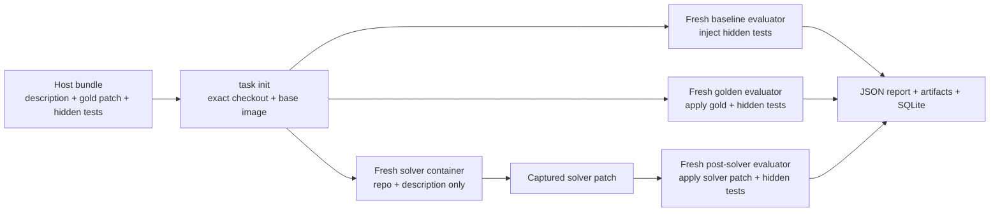

# Task Bundle CLI

> A Python CLI for packaging arbitrary coding tasks into reproducible containers, validating their baseline and golden behavior, running an LLM-backed solver without exposing hidden tests, and recording structured results.

## Project status

**Current phase:** assignment-required implementation and validation complete; optional hardening backlog remains  
**Last updated:** 2026-08-09  
**Implementation status:** every assignment-required workflow works end to end on both the local fixture and a checked-in public SWE-bench Pro instance

This README is the living project record. It documents what we are building, why each material decision was made, how we will verify it, and what remains unresolved. It must be updated whenever a decision changes, a phase is completed, or validation produces new evidence.

## The problem

Coding benchmark tasks combine:

1. a repository at an exact revision;
2. a problem statement shown to a solver; and
3. hidden tests used to grade the solver's patch.

The manual version of this workflow is slow and fragile: engineers repeatedly reconstruct repositories, install inconsistent dependencies, hide and reveal tests at the right times, apply patches, interpret test output, and preserve logs. This project turns that workflow into a small set of repeatable CLI commands.

The benchmark terminology used here follows SWE-bench:

- **FAIL_TO_PASS** tests fail against the baseline repository and must pass after a correct patch.
- **PASS_TO_PASS** tests pass against the baseline and must continue to pass after a patch, protecting against regressions.
- A solver fully resolves a task only when both sets pass after its changes.
- Hidden grading tests must not be visible to the solver.

The assignment requires Python and, at minimum, these commands:

```text
task init
task validate
task run
```

It also requires command-level logging in a lightweight database and an end-to-end demonstration on one public SWE-bench Pro task.

## Goals

- Reconstruct a repository at an exact commit and package it in a working container image.
- Let task authors describe installation and test commands without hard-coding a language or test framework into the CLI.
- Prove that a task is valid before spending an LLM run on it.
- Keep the hidden test patch, test commands, and golden patch unavailable to the solver.
- Capture the solver's code changes as a patch and grade them in a fresh evaluator container.
- Produce both readable terminal output and machine-readable JSON.
- Persist command history, lifecycle events, test results, and artifact locations in SQLite.
- Make infrastructure failures distinguishable from invalid tasks and incorrect solver attempts.
- Demonstrate the complete flow on a small local fixture and one public SWE-bench Pro instance.

## Non-goals for the take-home

- A distributed job queue or multi-node scheduler.
- Kubernetes, remote container orchestration, or a hosted control plane.
- A web UI.
- Supporting every possible container runtime in the first version.
- Building a new general-purpose coding agent. The CLI defines a solver interface and safely runs an existing LLM agent command.
- Perfect protection against a hostile kernel or container-runtime exploit. The target boundary is untrusted solver code isolated from ordinary host resources using Docker controls.

These exclusions keep the implementation focused on a demonstrable vertical slice rather than speculative infrastructure.

## User experience

The intended workflow is:

```bash
# Optional convenience command: scaffold editable bundle files.
task new ./bundles/example --repo https://github.com/org/repo.git --commit <40-char-sha>

# Materialize the exact repository, build the image, and run an environment smoke check.
task init ./bundles/example

# Check baseline expectations and prove that the golden patch resolves the task.
task validate ./bundles/example

# Run a solver, capture its patch, then grade it in a separate container.
task run ./bundles/example --solver command --solver-cmd '<agent command>'

# Inspect durable command history and logs.
task history ./bundles/example
task logs <command-id> --bundle ./bundles/example
```

Every bundle path defaults to the current directory, so a task author working inside a bundle can use `task init`, `task validate`, and `task run` exactly as requested by the assignment.

### Copy-paste quickstart

```bash
uv sync --frozen

# Fast checks; the Docker integration test is opt-in.
uv run --no-sync pytest -q
uv run --no-sync ruff check .
uv run --no-sync mypy src

# Complete public benchmark proof. Use plain `docker` on a normal setup.
task init examples/swe-bench-pro-ansible
task validate examples/swe-bench-pro-ansible
task run examples/swe-bench-pro-ansible --solver stub
task run examples/swe-bench-pro-ansible \
  --solver patch \
  --candidate-patch examples/swe-bench-pro-ansible/gold.patch
task history examples/swe-bench-pro-ansible
task logs <command-id> --bundle examples/swe-bench-pro-ansible
```

The stub command is expected to exit `1` with an `unresolved` report. On this development machine, the host Docker socket is unreliable, so recorded Docker runs use the controlled `TASKBUNDLE_DOCKER_BIN=/tmp/theta-colima-docker/docker` transport described in D-022. That override is not needed on a standard Docker installation.

### CLI outcome rules

- Human-readable progress goes to stderr so JSON output on stdout remains pipeable.
- `--json` emits the final structured result.
- Every top-level invocation receives a sortable unique command ID.
- Error messages state the failed phase, the relevant container or test, the artifact path, and a suggested next action.
- Exit code `0` means the requested expectation was satisfied.
- Exit code `1` means the lifecycle completed but validation failed or the solver did not resolve the task.
- Exit code `2` is reserved for invalid CLI usage or bundle configuration.
- Exit code `3` represents infrastructure failures such as Docker, Git, trusted-patch application, and smoke/evaluator execution failures.
- Exit code `4` represents a solver process failure before a gradeable patch was produced.

Test timeouts during author validation are invalid-task outcomes (`1`), while solver-process timeouts are solver failures (`4`). These meanings are implemented as enums and treated as a stable scripting contract.

## Bundle contract

The first schema is intentionally small:

```text
my-task/
├── task.json
├── description.md
├── gold.patch
├── environment/
│   └── Dockerfile
└── tests/
    └── hidden.patch
```

- `task.json` is the versioned, validated manifest.
- `description.md` is the only bundle document explicitly copied into the solver container.
- `gold.patch` is the trusted reference solution used by `task validate`, never by a normal solver run.
- `tests/hidden.patch` adds or changes grading tests only after the solver has finished.
- `environment/Dockerfile` defines repository-specific system and language dependencies.

Existing tests already present at the base commit stay visible to the solver. Only the task-specific PASS_TO_PASS and FAIL_TO_PASS grading material is hidden.

### Initial manifest shape

This is the implemented schema:

```json
{
  "schema_version": 1,
  "id": "example-task",
  "repository": {
    "url": "https://github.com/example/project.git",
    "commit": "0123456789abcdef0123456789abcdef01234567"
  },
  "environment": {
    "dockerfile": "environment/Dockerfile",
    "workdir": "/workspace",
    "smoke_command": "python -m pytest --version",
    "smoke_timeout_seconds": 300
  },
  "patches": {
    "gold": "gold.patch",
    "tests": "tests/hidden.patch"
  },
  "tests": {
    "pass_to_pass": [
      {
        "id": "existing-behavior",
        "command": "python -m pytest -q tests/test_existing.py::test_behavior",
        "timeout_seconds": 120
      }
    ],
    "fail_to_pass": [
      {
        "id": "requested-fix",
        "command": "python -m pytest -q tests/test_regression.py::test_requested_fix",
        "timeout_seconds": 120
      }
    ]
  },
  "validation": {
    "repetitions": 3
  },
  "runtime": {
    "cpus": 2,
    "memory": "4g",
    "pids": 256,
    "solver_timeout_seconds": 1800,
    "max_patch_bytes": 10000000,
    "solver_network": false
  }
}
```

Test entries are named commands rather than pytest-specific selectors. This costs some execution speed because tests may run separately, but it makes the first version work with Python, JavaScript, TypeScript, Go, or any other repository that can expose an exit-code-based test command. Later, a test-runner adapter may batch commands while retaining per-test parsing.

All bundle-relative paths are resolved against the bundle root and rejected if they escape it. Repository commits must be full 40-character hashes, not mutable branches or tags.

## Lifecycle and trust boundaries



The separate containers are deliberate. A baseline evaluator may see hidden tests, but it is destroyed before the solver starts. The solver container never receives the bundle directory, golden patch, hidden test patch, evaluator commands, Docker socket, or a host source-code bind mount. Only the captured solver diff crosses from the solver phase into the evaluator phase.

### `task init`

`task init` will:

1. validate the manifest and required bundle files;
2. fetch the repository at the exact commit into a generated build context;
3. verify that `HEAD` exactly matches the requested hash;
4. include only the clean source checkout and environment Dockerfile in the Docker build context;
5. build a content-addressed base image tagged with the bundle ID and build fingerprint;
6. record the image ID, repository commit, Docker version, and fingerprint;
7. run the configured smoke command in a fresh container; and
8. persist the command result and logs.

The generated context prevents a broad `COPY .` in a task Dockerfile from accidentally baking the golden patch or hidden tests into the image.

### `task validate`

Validation uses fresh containers and checks this complete truth table:

| Repository state | PASS_TO_PASS | FAIL_TO_PASS | Meaning |
| --- | --- | --- | --- |
| Baseline + hidden tests | all pass | all fail | The issue exists and unrelated behavior is healthy. |
| Golden patch + hidden tests | all pass | all pass | The task is solvable and the reference patch is regression-free. |

Each configured test is repeated according to `validation.repetitions`. A test whose outcomes disagree across repetitions is reported as flaky, and validation fails rather than silently accepting it.

Checking the golden state goes beyond the minimum baseline wording, but it prevents task authors from publishing broken hidden tests, an unapplyable patch, or an environment in which no solution can pass.

### `task run`

`task run` will:

1. create a command record;
2. repeat the baseline preflight in a disposable evaluator container;
3. stop immediately with `INVALID_TASK` if baseline expectations are not met;
4. create a separate solver container from the same base image;
5. copy only `description.md` to `/tmp/taskbundle-description.md`;
6. invoke the selected solver adapter inside `/workspace`;
7. capture stdout, stderr, timing, exit code, final Git status, and a staged `git diff --binary --full-index` that includes untracked files;
8. destroy the solver container;
9. create a fresh evaluator container;
10. apply the solver patch and then the hidden test patch;
11. run PASS_TO_PASS and FAIL_TO_PASS tests; and
12. write a structured report and final database state.

A run is `RESOLVED` only when every post-solver PASS_TO_PASS and FAIL_TO_PASS test passes. A normal test failure is `UNRESOLVED`, not an infrastructure error. Patch-application failure, container failure, timeout, or missing output is classified separately so model quality is not blamed for broken infrastructure.

## Solver interface

The core runner depends on a small `Solver` protocol rather than a particular model provider. The implemented adapters are:

- `stub`: makes no changes and proves that the full unresolved path and report generation work.
- `patch`: applies an explicitly supplied candidate patch. This gives us a deterministic integration test and can represent a patch produced by an external LLM.
- `command`: runs a configured coding-agent command inside the solver container. This is the real LLM path and remains compatible with different providers and agent scaffolds.

The command adapter is preferable to embedding a large custom agent loop in this take-home. The problem being evaluated is lifecycle infrastructure, isolation, grading, and observability; an existing agent command can own model interaction. Provider-specific adapters can be added behind the same protocol later.

Remote LLM access creates an explicit safety tradeoff. Solver containers have no network by default. Network requires both `runtime.solver_network=true` in the manifest and `--allow-network` on that individual run. Secrets use repeatable `--secret-env NAME` options; the CLI validates that each variable exists and forwards only its name to Docker, while redacting the entire `--solver-cmd` value from the command ledger. Secret values are never deliberately copied into reports or artifacts.

## Container safety model

Solver-authored code is untrusted. Every solver and evaluator container therefore uses:

- no Docker socket;
- no host source or bundle bind mount;
- no privileged mode;
- dropped Linux capabilities where compatible;
- `no-new-privileges`;
- CPU, memory, process-count, and wall-clock limits;
- network disabled for evaluators and disabled by default for solvers;
- an explicit working directory and configurable non-root user; and
- guaranteed cleanup in `finally` blocks, with container IDs retained in logs if cleanup itself fails.

Docker builds may require network access to fetch dependencies. That happens before solver code runs and is recorded separately. Evaluation always runs offline so a test cannot silently depend on a live external service.

This model materially limits ordinary malicious or accidental behavior, but it is not a formal sandbox. Docker daemon trust remains a limitation; genuinely hostile workloads should run on a disposable machine or VM.

## Reproducibility model

The implemented initialization fingerprint contains:

- the build-context schema and CLI version;
- exact repository URL and commit;
- environment Dockerfile bytes;

The resulting metadata also records the immutable image ID plus Git, Docker client, and Docker server versions. Test commands, repetitions, image identity, network mode, solver outcome, patch hash/size, and per-attempt results are retained through reports, the artifact table, and command events. A single combined run-fingerprint field and host-platform record are not yet implemented; exact command IDs and artifact hashes provide the current audit trail.

Digest-pinned `FROM` references are recommended. The public example pins its base manifest and `dataset.json` records exact dataset and official-harness revisions.

`task init` may reuse an image only when its build fingerprint matches. `task run` never reuses a modified container or workspace.

## Persistence and observability

SQLite is sufficient for a local CLI, requires no service, supports transactional writes, and is easy for collaborators to query. The database lives under `<bundle>/.taskbundle/taskbundle.db`.

Implemented tables:

- `commands`: one row per CLI invocation, including ID, command name, sanitized arguments, timestamps, status, exit code, bundle ID, and error classification;
- `events`: ordered structured lifecycle messages attached to a command;
- `test_results`: phase, suite, test ID, repetition, expectation, observation, exit code, duration, and log artifact;
- `artifacts`: kind, relative path, content hash, size, and owning command.

Schema changes use SQLite's `user_version` and will continue through small forward-only migrations rather than an ORM and migration framework.

### Artifact layout

```text
<bundle>/.taskbundle/
├── taskbundle.db
├── cache/
│   └── <build-fingerprint>/
└── commands/
    └── <command-id>/
        ├── report.json
        ├── run.json
        ├── solver.stdout.log
        ├── solver.stderr.log
        ├── solver.patch
        ├── repository-status.txt
        └── tests/
            └── <phase>-<suite>-<test-id>-<attempt>.log
```

The database stores queryable summaries; larger output remains in content-hashed files. All stored artifact paths are relative to the state directory so a bundle's state can be moved without rewriting the database.

## Code structure

```text
.
├── pyproject.toml
├── README.md
├── src/taskbundle/
│   ├── cli.py
│   ├── config.py
│   ├── errors.py
│   ├── models.py
│   ├── process.py
│   ├── database.py
│   ├── artifacts.py
│   ├── ids.py
│   ├── scaffold.py
│   ├── session.py
│   ├── engine/
│   │   ├── docker.py
│   │   └── git.py
│   ├── lifecycle/
│   │   ├── initialize.py
│   │   ├── validate.py
│   │   └── run.py
│   └── solvers/
│       ├── base.py
│       ├── stub.py
│       ├── patch.py
│       └── command.py
├── tests/
│   ├── unit/
│   ├── integration/
│   └── fixtures/
└── examples/
    └── swe-bench-pro-ansible/
```

The CLI layer remains thin. Lifecycle functions take typed inputs and a process-runner interface; Docker, persistence, artifact, and solver boundaries remain explicit. This keeps unit tests fast without hiding the real Docker integration behind excessive abstractions.

## Technology choices

| Area | Initial choice | Why |
| --- | --- | --- |
| Language | Python 3.12+ | Required by the assignment; modern typing and `tomllib`/stdlib improvements are available. |
| Packaging | `pyproject.toml` with a `task` console script | Standard installation and the exact requested CLI name. |
| Dependency workflow | `uv` with a committed lockfile | Fast, deterministic local and CI setup. |
| CLI | Typer | Typed commands, readable help, completion support, and low boilerplate. |
| Terminal rendering | Rich through Typer | Clear progress and tables while preserving a separate JSON mode. |
| Manifest validation | Pydantic | Good nested validation and actionable field-level errors. |
| Database | stdlib `sqlite3` | Lightweight, transactional, portable, and no ORM is needed for four tables. |
| Container integration | Docker CLI via a controlled subprocess wrapper | Auditable commands, easy parity with manual debugging, and no Docker SDK dependency. |
| Structured output | JSON | Stable for automation and language-neutral. |
| Tests | pytest | Strong fixtures, subprocess testing, and straightforward integration markers. |
| Quality checks | Ruff and mypy | Fast lint/format checks plus static verification of lifecycle boundaries. |

Versions are locked in `uv.lock`. The CLI currently runs under Python 3.12.10.

## Current implementation and verification

The executable implementation now includes:

- the installable `task` console script and `python -m taskbundle` entry point;
- strict Pydantic models for `task.json`, command reports, errors, and test results;
- bundle-relative path and symlink-escape protection;
- stable exit and error classifications;
- sortable command IDs and sanitized argument recording;
- transactional SQLite migrations and command, event, test-result, and artifact tables;
- atomic, content-hashed artifact writes;
- a timeout-aware subprocess runner;
- exact detached Git checkouts with a clean-worktree assertion;
- restricted build contexts containing only `Dockerfile` and `source/`;
- content-derived image tags, labels, cached build metadata, and verified image reuse;
- isolated offline smoke containers with CPU, memory, PID, capability, privilege, user, and timeout controls;
- guaranteed smoke-container removal on pass, failure, and timeout paths;
- separate offline baseline and golden evaluator containers;
- patch copy, preflight, application, and durable diagnostics without host bind mounts;
- named PASS_TO_PASS and FAIL_TO_PASS execution with per-attempt timeouts, logs, database rows, and expectation matching;
- repeated-test flakiness detection and a structured validation matrix;
- a baseline preflight before every solver invocation and fresh post-solver grading;
- provider-neutral `stub`, `patch`, and `command` solver adapters;
- solver containers that receive the repository and description but no hidden tests, golden patch, bundle mount, or Docker socket;
- binary-safe candidate capture using `git add -A` followed by a cached full-index diff, including untracked files and deletions;
- durable solver stdout, stderr, status, patch, per-test, and structured run artifacts;
- distinct unresolved, solver, invalid-task, configuration, and infrastructure outcomes;
- opt-in solver networking, environment-name secret allowlists, solver-command redaction, patch-size limits, and forced cleanup; and
- working `task new`, `task init`, `task validate`, `task run`, `task history`, `task logs`, and `task doctor` commands.

Evidence captured on 2026-08-09:

| Check | Result |
| --- | --- |
| `uv run pytest -q` | 31 passed, 1 Docker test skipped by default |
| Docker integration test | 1 passed in 44.30s: build, smoke, reuse, validate, stub-unresolved, command-resolved, patch-resolved, log query, image inspection, and cleanup |
| `uv run mypy src` | Success: no issues in 24 source files |
| `uv run ruff check .` | All checks passed |
| `uv run task --version` | `0.1.0` |
| `uv build --offline` | Source distribution and universal Python wheel built successfully |
| `uv run task doctor . --json` | Python 3.12.10, Git 2.50.1, Docker client 29.5.2, and Docker daemon 29.5.2 passed |
| Built fixture image | `taskbundle/minimal-python:8a650b436e651273`, image `f5e43e31417c`, 78,215,945 bytes by image inspection |
| Image audit | Exact revision `24f1c0eb13c43f3166f2a29c85dc321529857a63`; hidden sentinel absent |
| Cleanup audit | No `taskbundle-minimal-python` containers remained |
| Validation truth table | Baseline P2P passed 3/3, baseline F2P failed 3/3, golden P2P and F2P passed 3/3 |
| Validation persistence | 12 test-result rows, 12 test logs, 6 patch logs, and one `validation.json` artifact |
| Run truth table | Stub remained unresolved; command and deterministic patch solvers resolved; baseline and post-solver rows were persisted |
| Solver visibility/capture | Hidden sentinel lookup returned no match; command patch contained the intended edit and a newly created untracked file |
| Public SWE-bench Pro proof | Exact Ansible instance initialized, 30-attempt validation passed, stub was unresolved, dataset gold patch resolved all 30 run attempts, and SQLite/log queries succeeded |

The project directory is now a Git repository. No commit has been created by the implementation process.

## Build plan

### Phase 0 — contracts and fixture

- [x] Extract assignment requirements and relevant SWE-bench semantics.
- [x] Define the initial lifecycle, trust boundary, bundle format, and status model.
- [x] Create this living README.
- [x] Create a tiny local Git repository fixture with one regression, public tests, a hidden FAIL_TO_PASS test, a PASS_TO_PASS test, and a golden patch.
- [x] Freeze example `task.json`, `report.json`, and error payload schemas in tests.

**Exit criterion:** the local fixture expresses every lifecycle state without network access.

### Phase 1 — Python project, CLI shell, and command ledger

- [x] Add `pyproject.toml`, locked dependencies, and the `task` console entry point.
- [x] Implement typed manifest models and secure path resolution.
- [x] Implement the SQLite schema, migrations, command wrapper, events, and artifacts.
- [x] Add `task new`, `task history`, `task logs`, and `task doctor` alongside the three required commands.
- [x] Establish exit codes and JSON error envelopes.

**Exit criterion:** every CLI command, including a failed one, creates a queryable command record and produces tested help/JSON output.

### Phase 2 — deterministic initialization

- [x] Implement exact-commit Git fetch and detached checkout.
- [x] Generate the restricted Docker build context.
- [x] Build and fingerprint the base image.
- [x] Run the smoke command with resource limits.
- [x] Make initialization idempotent when inputs are unchanged.

**Exit criterion:** `task init` builds the local fixture from a clean machine state, verifies the commit and smoke command, and records the image ID.

### Phase 3 — validation engine

- [x] Implement safe patch application with preflight checks and captured diagnostics.
- [x] Run named tests with independent timeouts and logs.
- [x] Evaluate baseline and golden truth tables in fresh containers.
- [x] Detect inconsistent repeated outcomes as flakiness.
- [x] Render a concise matrix and emit a complete JSON report.

**Exit criterion:** the valid fixture passes validation, while intentionally broken commit, environment, test, and golden-patch variants fail with distinct classifications.

### Phase 4 — solver execution and grading

- [x] Implement the solver protocol and `stub`, `patch`, and `command` adapters.
- [x] Enforce the solver-container visibility boundary.
- [x] Capture a binary-safe Git patch and workspace metadata.
- [x] Grade the patch in a fresh evaluator container.
- [x] Implement opt-in network and secret-name allowlists.
- [x] Ensure containers are cleaned up after success, failure, and timeout.

**Exit criterion:** a stub run is reported as unresolved, a known candidate patch resolves the local fixture, and a sentinel hidden-test string cannot be found from the solver container.

### Phase 5 — end-to-end SWE-bench Pro proof

- [x] Select one public instance with a manageable repository size and runtime.
- [x] Convert its dataset fields into the bundle contract without changing the benchmark semantics.
- [x] Build the environment at `base_commit`.
- [x] Run `task init` and preserve evidence.
- [x] Run three-repetition baseline and golden validation.
- [x] Run the stub solver and one deterministic candidate-patch solver.
- [x] Query command IDs through `task logs` and direct SQLite SQL.
- [x] Record exact timings, image size, commands, output, and the dataset-specific adaptation here.

**Exit criterion:** a reviewer can reproduce all four required actions—init, validate, run, and log query—from documented commands and inspect saved reports.

### Phase 6 — hardening and submission polish

- [ ] Exercise every destructive or host-level failure, including disk exhaustion and SIGTERM during a Docker build. Malformed manifests, path/symlink traversal, missing tools/images, patch conflict, subprocess timeout, Ctrl-C persistence/cleanup, and flaky tests already have coverage.
- [x] Verify offline network arguments, resource flags, no bind mounts, no Docker socket, hidden-test absence, and cleanup.
- [x] Run Ruff, mypy, unit tests, Docker integration tests, and both end-to-end fixtures.
- [x] Add an architecture/trust-boundary note and copy-paste quickstart.
- [x] Confirm implemented claims in this README against the final code and evidence; remaining limitations are explicit.

**Exit criterion:** all automated checks pass, commands are reproducible from a clean checkout, and remaining limitations are explicit.

## Validation strategy

We will validate behavior at three levels:

### Unit tests

- Manifest validation and schema-version errors.
- Bundle-relative path containment and symlink escape rejection.
- Fingerprint determinism.
- Subprocess exit, timeout, decoding, and cancellation handling.
- State transitions and error classification.
- SQLite transactions, migration, and log queries.
- Secret redaction.

### Docker integration tests

- Exact commit is present in the image.
- The generated context excludes hidden and golden files.
- Containers receive the expected resource and network flags.
- Patches and tests run in the correct order.
- A timeout kills and removes the container.
- Solver modifications survive only as a captured patch.

### End-to-end tests

- Local fixture baseline is PASS_TO_PASS=pass and FAIL_TO_PASS=fail.
- Local fixture golden state is all-pass.
- Stub solver is unresolved with valid infrastructure.
- Candidate solver patch is resolved.
- Regression patch fixes FAIL_TO_PASS but breaks PASS_TO_PASS and remains unresolved.
- Hidden-test sentinel is absent during solver execution.
- One public SWE-bench Pro example completes the same lifecycle.

For each end-to-end run we will retain command IDs, reports, test logs, the solver patch, image metadata, and exact CLI output. A final handoff will report whether any Docker containers or processes remain running.

## Requirements traceability

| Assignment requirement | Implementation | Proof |
| --- | --- | --- |
| Package repository at a commit | Exact SHA checkout plus fingerprinted Docker image | `task init` integration test and image metadata |
| Validate dependencies/tests | Smoke command plus baseline and golden evaluation | Init log and validation matrix |
| Baseline PASS_TO_PASS passes | Baseline evaluator | Per-test records and exit code |
| Baseline FAIL_TO_PASS fails | Baseline evaluator | Per-test records and exit code |
| Run solver without hidden tests | Dedicated solver container with description only | Sentinel visibility integration test |
| Test before and after solver | Preflight evaluator and post-solver evaluator | Phase-tagged results in one run report |
| Structured solver results | Versioned `report.json` and `--json` | Schema tests and saved example |
| Persistent command logs | SQLite command/event/test/artifact tables | `task logs` plus direct SQL query |
| Arbitrary repositories | Dockerfile plus named shell test commands | Python fixture and non-Python SWE-bench Pro candidate where practical |
| Isolation | No mounts/socket, network policy, limits, cleanup | Docker-argument tests and adversarial fixture |
| Reproducibility | Exact commits, lockfile, fingerprints, image/platform metadata | Repeated clean-build comparison |

## Decision log

| ID | Status | Decision | Rationale |
| --- | --- | --- | --- |
| D-001 | Accepted | Use a versioned JSON bundle manifest. | JSON is portable, deterministic to normalize, and maps directly to structured validation and reports. |
| D-002 | Accepted | Require a task-owned Dockerfile. | Arbitrary repositories need explicit, repository-specific system and language dependencies; automatic inference is too brittle. |
| D-003 | Accepted | Use Docker as the first and only runtime backend. | It directly addresses isolation and reproducibility while keeping the take-home scope bounded. |
| D-004 | Accepted | Keep hidden tests and the golden patch out of the build context and solver container. | Accidental leakage would invalidate benchmark results. |
| D-005 | Accepted | Use separate baseline, solver, golden, and post-solver containers. | Isolation by lifecycle phase is easier to audit than trying to hide files inside one reused workspace. |
| D-006 | Accepted | Stage all changes and capture `git diff --cached --binary --full-index`. | Staging with `git add -A` includes untracked files and deletions; the binary/full-index patch remains portable, inspectable, and hashable. |
| D-007 | Accepted | Validate both baseline and golden behavior. | Baseline checks alone cannot prove that hidden tests or the reference solution are valid. |
| D-008 | Accepted | Represent each graded test as a named command initially. | This avoids coupling the core to pytest and supports mixed languages and frameworks. |
| D-009 | Accepted | Use SQLite without an ORM. | The schema is small, SQL improves transparency, and an ORM would add little value. |
| D-010 | Accepted | Store summaries in SQLite and full logs as artifacts. | It keeps queries fast and the database compact without losing debugging evidence. |
| D-011 | Accepted | Treat task, solver, and infrastructure failures as different states. | Reliable benchmark statistics must not count environment failures as model failures. |
| D-012 | Accepted | Use an external agent command as the real LLM integration. | It preserves provider flexibility and keeps this project focused on evaluation infrastructure. |
| D-013 | Accepted | Disable solver networking by default and require explicit secret-name allowlists. | Remote agents need credentials, but silent network and environment inheritance would be unsafe. |
| D-014 | Accepted | Add `task new` rather than overloading `task init`. | Scaffolding author files and materializing a completed bundle are distinct operations with clearer failure modes. |
| D-015 | Accepted | Repeat validation tests and fail on inconsistent outcomes. | Flaky grading produces misleading solver scores; SWE-bench Pro also repeats tests to filter instability. |
| D-016 | Deferred | Add batched test-runner adapters. | Useful for performance, but only after the command-per-test contract works end to end. |
| D-017 | Deferred | Add a provider-specific API solver. | The command solver satisfies real-agent integration without committing the core to one model vendor. |
| D-018 | Rejected for MVP | Add queues, workers, Kubernetes, or a server. | None is required to prove the local lifecycle and each would weaken delivery focus. |
| D-019 | Accepted | Persist a versioned report artifact for successful and expected failed commands. | A failed command must be inspectable by ID without relying on terminal scrollback. |
| D-020 | Superseded | Keep unimplemented lifecycle commands visible, but fail explicitly. | This stabilized help and error contracts during early phases; all required lifecycle commands are now implemented. |
| D-021 | Accepted | Reuse an image only when cached metadata and Docker's current image ID agree. | A matching tag alone is mutable and therefore insufficient evidence of reproducibility. |
| D-022 | Accepted | Allow a Docker-compatible executable override through `TASKBUNDLE_DOCKER_BIN`. | It supports controlled wrappers and remote transports without allowing arbitrary shell fragments or changing the default Docker CLI contract. |
| D-023 | Accepted | Cache initialization only after the offline smoke command succeeds. | A built image with broken dependencies is not an initialized task environment. |
| D-024 | Accepted | Use one fresh evaluator container for baseline and another for golden validation. | Phase separation prevents a patch, generated file, or test side effect from contaminating the other truth-table state. |
| D-025 | Accepted | Apply the gold patch before the hidden test patch in the golden evaluator. | Candidate and gold patches are authored against the clean base; hidden test additions are grading material applied afterward. |
| D-026 | Accepted | Persist every repetition rather than only aggregate status. | Individual exit codes, timings, and logs are necessary to prove stability and diagnose flakiness. |
| D-027 | Accepted | Treat test timeout and inconsistent observations as invalid-task results. | Neither condition produces a trustworthy model grade, even when some attempts match expectations. |
| D-028 | Accepted | Run baseline preflight before every solver and grade in a different fresh container. | Invalid or drifted tasks should stop before model cost, and solver side effects must not contaminate grading. |
| D-029 | Accepted | Require both manifest permission and a per-run CLI flag for solver network. | Task authors and run operators each provide explicit consent; either can keep execution offline. |
| D-030 | Accepted | Forward secrets only through validated environment-variable names. | Docker receives `--env NAME`, so the CLI does not put secret values in its argv, database, or artifacts. |
| D-031 | Accepted | Grade a successful no-change solver as unresolved. | A no-op is a valid model attempt rather than a solver infrastructure failure, which lets the stub exercise the real grading path. |
| D-032 | Accepted | Cap captured patches at 10 MB by default. | This prevents accidental or adversarial repository churn from creating unbounded artifacts while remaining configurable per bundle. |
| D-033 | Accepted | Keep the container user manifest-configurable rather than forcing a universal non-root UID. | Arbitrary images have incompatible ownership assumptions; resource limits, dropped capabilities, no-new-privileges, no mounts, and offline defaults apply regardless. |
| D-034 | Accepted | Use Ansible instance `12734fa2…` for the public proof. | It is a current official row with one F2P and four P2P selectors in one unit-test file, keeping runtime and service dependencies bounded. |
| D-035 | Accepted | Preserve official benchmark inputs but reconstruct the dependency image natively on ARM64. | The official image is amd64-only and the available Colima VM has no emulation; the dataset source commit, description semantics, patches, and selectors remain unchanged, while base and Python dependencies are digest/version pinned. |
| D-036 | Accepted | Persist Ctrl-C as an infrastructure failure after lifecycle cleanup. | A durable failed row is more truthful than leaving the command indefinitely `running`, and lifecycle `finally` blocks still remove disposable containers. |

## Open questions and when we will resolve them

- **Should solver networking support a domain allowlist?** Docker's basic network modes do not provide this directly. For the MVP use disabled/enabled; document a proxy-based allowlist as future hardening.
- **Should command history be bundle-local or global?** Start bundle-local for portability. Reconsider only if the example workflow shows a strong cross-bundle query need.
- **How many validation repetitions by default?** Keep three for confidence: the selected public validation completed 30 attempts in 25.49 seconds. `--repetitions 1` remains available for fast local iteration.

## Progress log

### 2026-08-09 — final hardening and audit

- Added durable Ctrl-C handling at the CLI boundary and a solver-interruption test proving the baseline and solver containers are still removed.
- Added explicit unit proof that solver containers have no volume/mount arguments and that enabled network and secret-name forwarding appear only when requested.
- Added an immutable provenance test for the checked-in SWE-bench Pro bundle, including dataset/harness revisions and exact patch hashes.
- Final checks: 31 tests passed with one opt-in Docker test skipped, strict mypy passed across 24 source files, Ruff formatting/lint passed, and both sdist and wheel built offline.
- Final Docker integration passed in 44.30 seconds. `task doctor` command `20260809T180039309438Z-002f4ef1` passed Python 3.12.10, Git 2.50.1, and Docker client/daemon 29.5.2.
- Final runtime state: no taskbundle containers remain; the audited minimal and public images remain; unrelated Metabase and healthy PostgreSQL containers remain running.

### 2026-08-09 — public SWE-bench Pro end-to-end proof

- Selected current dataset instance `instance_ansible__ansible-12734fa21c08a0ce8c84e533abdc560db2eb1955-v7eee2454f617569fd6889f2211f75bc02a35f9f8` at Ansible commit `de01db08d00c8d2438e1ba5989c313ba16a145b0`.
- Recorded dataset revision `7ab5114912baf22bb098818e604c02fe7ad2c11f`, official harness revision `ca10a60a5fcae51e6948ffe1485d4153d421e6c5`, official image digest, and exact patch hashes in `examples/swe-bench-pro-ansible/dataset.json` and an automated provenance test.
- Verified the checked-in golden patch and hidden patch are byte-identical to the current dataset row: SHA-256 `787d6337…` and `abfad560…` respectively.
- The official 1.69 GB amd64 image built but could not execute on the ARM64 VM without emulation. Preserved failed init command `20260809T174329518378Z-0a9f64e3`, replaced only the environment with a digest-pinned native Python 3.9 build, and removed the unusable task image afterward.
- Initialized native image `taskbundle/swebench-pro-ansible-12734fa2:af8097a9b0436008`, ID `sha256:7dd689e62090…`, inspect size 182,567,180 bytes, in 64.07 seconds. Smoke passed in 0.95 seconds and the image contains the exact base commit with the hidden test absent.
- Validation command `20260809T175125342571Z-2f495ec1` completed in 25.49 seconds: baseline P2P passed 12/12, baseline F2P failed 3/3, and golden P2P/F2P passed 15/15 with no mismatches or flakiness.
- Stub command `20260809T175202369806Z-25488c7a` completed in 27.36 seconds with exit 1: P2P remained 12/12 pass and F2P remained 3/3 fail after its empty patch, so it was correctly `unresolved`.
- Patch command `20260809T175239883065Z-df7c31c8` completed in 29.83 seconds with exit 0: its 3,204-byte normalized full-index patch resolved all 15 post-solver attempts.
- `task logs` command `20260809T175329400298Z-a186ad8a` returned the successful run by ID. Direct SQLite queries independently confirmed command status/exit codes, all phase aggregates, 30 validation logs, 30 logs for each solver run, patch logs, solver streams/status/patch, and structured reports.
- Final Docker audit found no taskbundle containers. The verified public and minimal fixture images remain; exact temporary/failing integration image tags were deleted. The unrelated Metabase and PostgreSQL containers are running and healthy/preserved.

### 2026-08-09 — isolated solver execution and grading

- Implemented the provider-neutral solver protocol plus `stub`, caller-supplied `patch`, and arbitrary `command` adapters.
- Implemented a baseline preflight, separate solver container, binary/full-index patch capture, solver cleanup, and post-solver evaluation in a fresh container.
- The solver receives only the initialized repository and copied task description. The Docker integration command actively searched for the hidden sentinel and would have exited with code 91 if it were visible; it was absent.
- Captured `git status --short --untracked-files=all`, staged with `git add -A`, and persisted a candidate patch that included both the intended source edit and a new untracked file.
- Added two-key network consent, repeatable secret environment-name forwarding, solver-command redaction, a configurable patch-size ceiling, and distinct exit code 4 solver failures.
- Added unit coverage for resolved/unresolved outcomes, timeout classification and cleanup, network policy, secret redaction, and untracked-file capture.
- Expanded the real Docker matrix: the stub was unresolved, the command adapter resolved the task without seeing hidden tests, the patch adapter resolved it deterministically, all run rows/artifacts were queryable, and no task containers remained.
- Removed four exact temporary integration image tags after the run and retained the previously audited fixture image; unrelated Colima workloads were left untouched.

### 2026-08-09 — baseline and golden validation

- Implemented fresh baseline and golden evaluators using the initialized image, offline networking, the same resource restrictions as smoke execution, and unconditional forced cleanup.
- Implemented host-to-container patch copying without mounts, `git apply --check`, patch application, and durable check/application logs.
- Implemented named PASS_TO_PASS and FAIL_TO_PASS execution with independent timeouts, stdout/stderr artifacts, SQLite test-result rows, and phase-specific expectations.
- Implemented manifest-driven repetitions, `--repetitions` override, aggregate matrices, mismatch reporting, and explicit flakiness detection.
- Added unit tests for the full 12-attempt valid matrix, an intermittent PASS_TO_PASS failure, patch-preflight failure, durable artifacts, and cleanup on failure.
- Expanded the real Docker integration test to call `task validate` and `task logs`. All baseline and golden expectations matched over three repetitions, 12 rows were queryable, and no evaluator containers remained.
- Made the generated fixture commit timestamp deterministic so the fixture's source revision is stable across test runs.

### 2026-08-09 — deterministic initialization

- Implemented exact shallow Git fetch, detached checkout, full-SHA verification, and clean-worktree validation.
- Implemented a generated Docker context containing only the trusted Dockerfile and exact source checkout; hidden tests, the description, and the golden patch are excluded.
- Implemented build fingerprints, deterministic image tags and labels, metadata validation, `--force-rebuild`, and image-ID-based reuse.
- Implemented offline smoke containers with resource limits, dropped capabilities, no-new-privileges, optional non-root execution, timeouts, and cleanup in `finally`.
- Added a Docker executable override for controlled transports and taught `task doctor` to verify the same executable.
- Added unit coverage for fingerprint inputs, hidden-test exclusion, build/reuse behavior, Docker arguments, timeout cleanup, and missing-image handling.
- Ran the Docker integration test against the minimal fixture: the first `task init` built and passed smoke, the second reused the same image ID, the image contained the exact commit and no hidden sentinel, and no task containers remained.
- Preserved unrelated running Colima workloads by using a temporary SSH-backed Docker wrapper instead of restarting a stale host socket.

### 2026-08-09 — executable foundation

- Initialized the project as a Git repository and added Python packaging with a locked dependency graph.
- Implemented strict bundle/report models, secure path resolution, error taxonomy, command IDs, subprocess execution, SQLite persistence, content-hashed artifacts, and command sessions.
- Implemented `task new`, `task history`, `task logs`, and `task doctor`; added explicit logged rejections for lifecycle commands before their engines are implemented.
- Added a generated local Git fixture whose baseline PASS_TO_PASS passes, baseline FAIL_TO_PASS fails, and golden state passes both.
- Added manifest, path-containment, schema, database, artifact, process, redaction, fixture-truth-table, and CLI tests.
- Verified the initial 15-test foundation, strict mypy, and Ruff lint. The first host-socket probe could not reach Docker, so live execution was deferred until Phase 2's non-disruptive transport was established.

### 2026-08-08 — initial design

- Read the assignment and confirmed the workspace contained no existing implementation.
- Reviewed the referenced SWE-bench definitions and SWE-bench Pro task/environment methodology.
- Chose a narrow Python + Docker + SQLite architecture.
- Defined the initial bundle, lifecycle truth tables, solver boundary, persistence model, failure taxonomy, artifact set, test strategy, and phased plan.
- Created this README before implementation so later changes can be compared with the original reasoning.

## References

- [OpenAI: Introducing SWE-bench Verified](https://openai.com/index/introducing-swe-bench-verified/) — baseline terminology, hidden-test evaluation, and the requirement that both FAIL_TO_PASS and PASS_TO_PASS pass for resolution.
- [Scale AI: SWE-bench Pro paper](https://static.scale.com/uploads/654197dc94d34f66c0f5184e/SWEAP_Eval_Scale%20%289%29.pdf) — task specification, multi-language container environments, repeated test verification, environment construction, and problem-description methodology.
- [ScaleAI/SWE-bench_Pro on Hugging Face](https://huggingface.co/datasets/ScaleAI/SWE-bench_Pro) — public dataset fields including repository, base commit, patches, problem statement, requirements, interface, language, and test lists.
